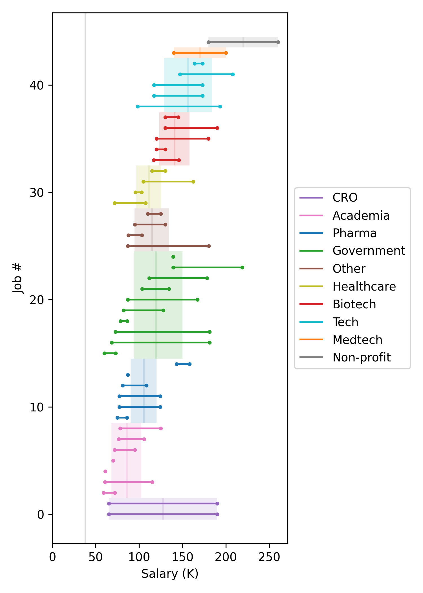
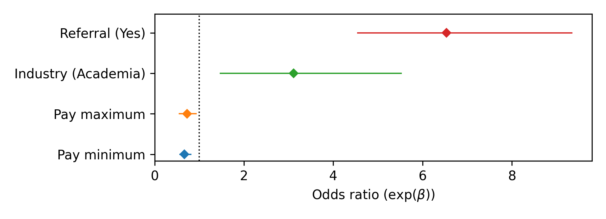
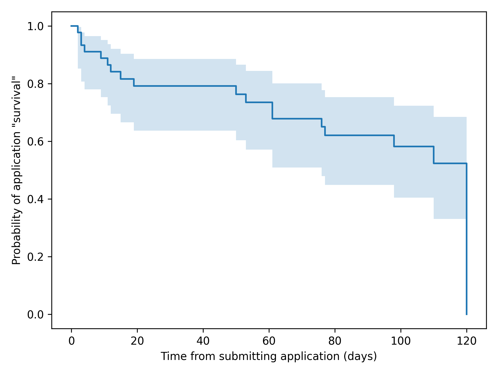

# job-search-eda
This is a repository for exploratory data analysis (EDA) of my post-PhD job search. As of June 27, 2025, I have considered and collected data for 79 job opportunities, and for 48 of these 79 opportunities (61%), I submitted completed applications. 58.3% of my applications received no response, 37.5% resulted in an explicit rejection, and 4.17% resulted in at least one interview. I received job offers from 2 employers, one for a postdoctoral fellowship, and one for a job as a biostatistician.

# Salary
Between November 11, 2024 and June 27, 2025, I applied to 45 jobs that listed at least a minimum target salary. This visualization shows the salary ranges grouped by industry and sorted by the mean within-industry minimum salary. The shaded boxes indicate the within-industry mean minimum and mean maximum salary. Unsurprisingly, jobs in academia - mostly postdoctoral fellowships - were associated with some of the lowest salaries; whereas jobs in Tech had some of the highest salaries. The vertical gray line on the left indicates my annual stipend as a graduated student the last year in my program ($38,110).

  

# Outcome
For the 48 job applications I submitted, I recorded whether I was able to convert these applications into invitations to interview. I was interested in understanding what factors influenced my "success" in converting my applications to interviews, so I used logistic regression to quantify the effect of the following factors:
- `Referral`: Did I have a personal connection that referred me for the job, yes (1) or no (0)
- `Industry`: Was the job in a non-academic (0) or an academic setting (1)
- `Pay minimum`: Minmum listed salary (Normalized 0-1)
- `Pay maximum`: Maximum listed salary (Normalize 0-1)

Here are the odds ratios (OR) and 95% confidence intervals (CI) for each of the factors listed above. ORs of less than 1 indicate that increases in the associated factor decreased my odds of getting an interview, ORs equal to 1 (black dotted line) indicate the factor had no impact on the outcome of my applications, and ORs greater than 1 indicated that increases in the associated factor increased the odds of me getting an interview.

  

The factor with the greatest OR was `Referral`. The odds of me getting an invitation to interview were greater if I had a personal connection to the job. The factor with the second greates OR was `Industry`. My odds of getting an interview were greatest for jobs in an academic setting. And finally, it seems like the greater the minimum and maximum salaries the lower the odds of my application being converted into an interview.

# Time
Most of my applications (53 out of 55) were eventually rejected, but it sometimes took months to hear back if I heard back at all from the hiring managers. To better understand the timing of rejection, I applied survival analysis to this dataset. The Kaplan-Meier curve (below) shows the probability of my applications "surviving" (i.e., not being rejected) as a function of time from when I submitted the application. For this analysis, I considered any applications still "alive" after 120 days "dead."

  

It looks like there is an initial wave of rejections from 0 to around 20 days post-submission and a secondary wave of rejections starting around 50 days post-submission. Interestingly, there seems to be a period between 20 and 50 days post-submission where I stop getting rejection letters for some reason. I suspect this is the time window in which I've made it past some initial screening procedure, but am not immediately being invited to interview.