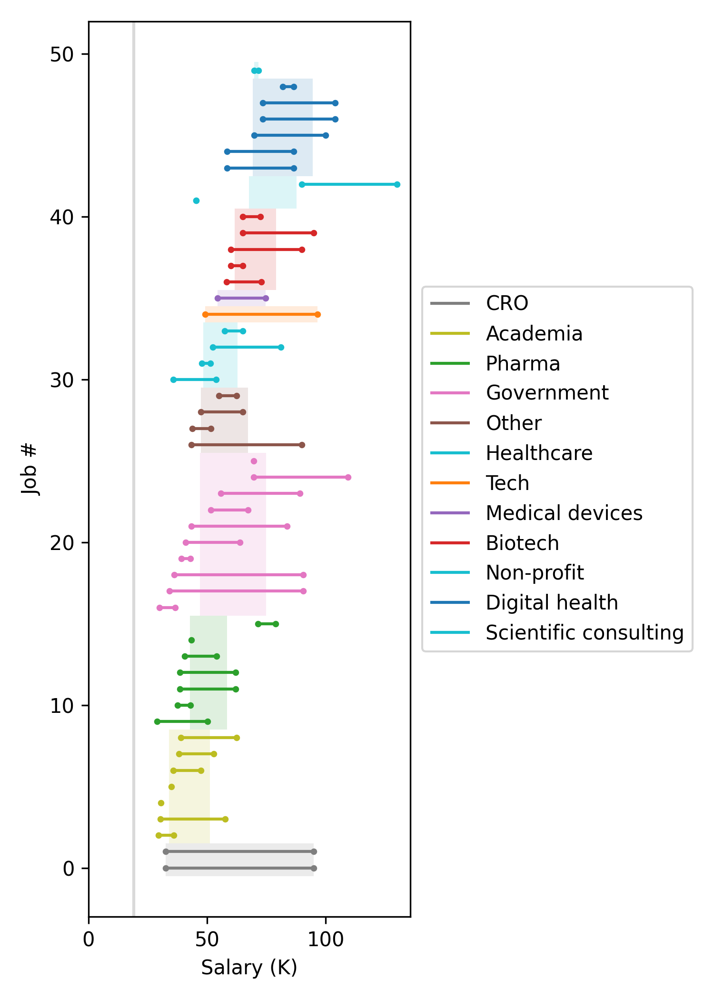

# job-search-eda
This is a repository for exploratory data analysis (EDA) of my post-PhD job search. As of June 27, 2025, I have considered and collected data for 79 job opportunities, and for 48 of these 79 opportunities (61%), I submitted completed applications. 58.3% of my applications received no response, 37.5% resulted in an explicit rejection, and 4.17% resulted in at least one interview. I received job offers from 2 employers, one for a postdoctoral fellowship, and one for a postiion as a biostatistician.

# Salary
Between November 11, 2024 and June 27, 2025, I applied to 45 jobs that listed at least a minimum target salary. This visualization shows the salary ranges grouped by industry and sorted by the mean within-industry minimum salary. The shaded boxes indicate the within-industry mean minimum and mean maximum salary. Unsurprisingly, jobs in academia - mostly postdoctoral fellowships - were associated with some of the lowest salaries; whereas jobs in Tech had some of the highest salaries. The vertical gray line on the left indicates my annual stipend as a graduated student the last year in my program ($38,110).

  

