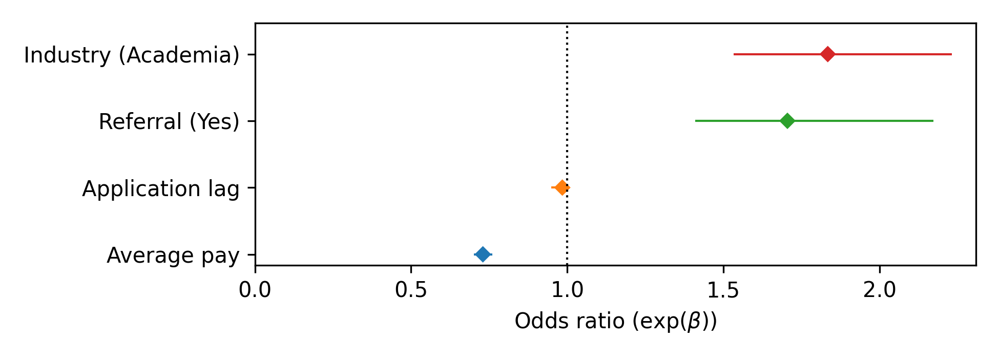

# job-search-eda
This is a repository for exploratory data analysis (EDA) of my post-Neuroscience PhD job search. As of July 1st, 2025, I have considered and collected data for 88 job opportunities, and for 55 of these jobs (61%), I submitted completed applications. 62.5% of my applications received no response, 32.1% resulted in an explicit rejection, and 5.36% resulted in at least one interview. I received job offers from 2 employers, one for a postdoctoral fellowship, and one for a job as a biostatistician.

# Salary
Between November 11, 2024 and July 1st, 2025, I applied to 50 jobs that listed at least a minimum target salary. This visualization shows the salary ranges grouped by industry and sorted by the mean within-industry minimum salary. The shaded boxes indicate the within-industry mean minimum and mean maximum salary. Unsurprisingly, jobs in academia - mostly postdoctoral fellowships - were associated with some of the lowest salaries; whereas jobs in Digital Health and Biotech had some of the highest salaries. The vertical gray line on the left indicates my annual stipend as a graduated student the last year in my program ($38,110/year).

  

# Outcome
For the 55 job applications I submitted, I recorded the outcome of the application: 0 indicates an explicit rejection and 1 indicates I was able to convert the application into some kind of interaction with a hiring manager. I was interested in understanding what factors influenced the "success" of my applications, so I used logistic regression to quantify the effect of the following factors:
- `Referral`: Did I have a personal connection that referred me for the job, yes (1) or no (0)
- `Industry`: Was the job in a non-academic (0) or an academic setting (1)
- `Average pay`: Average of the salary minimum and maximum (Normalized 0-1)
- `Application lag`: Latency (in days) from the day the job was posted to the day I submitted my application (Normalize 0-1)

Here are the odds ratios (OR) and 95% confidence intervals (CI) for each of the factors listed above. ORs of less than 1 indicate that increases in the associated factor decreased my odds of getting an interview, ORs equal to 1 (black dotted line) indicate the factor had no impact on the outcome of my applications, and ORs greater than 1 indicated that increases in the associated factor increased the odds of me getting an interview.

  

The factors with the greatest ORs were `Industry` and `Referral`. The odds of me eliciting an interaction with a hiring manager were greatest for jobs in academia with a personal connection to the employer (i.e., a referral). Additionally, it seems like the greater the average salaries the lower the odds of my application resulting in an interaction with a hiring manager. Finally, the latency from the job posting to when I submitted my application was not related to the outcome of my applications.

# Time
Most of my completed applications (53 out of 55) were eventually rejected, but it sometimes took months to hear back from the hiring managers, if I heard back at all. To better understand the timing of rejection, I applied survival analysis to this dataset. The Kaplan-Meier curve (below) shows the probability of my applications "surviving" (i.e., not being rejected) as a function of time from when I submitted the application. For this analysis, I only included applications that were rejected and applications that received no response, and I considered any applications still "alive" after 120 days effectively "dead." The shaded region above and below the curve indicates the 95% confidence interval.

  

It looks like there is an initial wave of rejections from 0 to around 20 days post-submission and a secondary wave of rejections starting around 50 days post-submission. Interestingly, there seems to be a period between 20 and 50 days post-submission where I stop getting rejections. I suspect this is the time window in which I've made it past some initial screening procedure, but am not immediately being invited to interview.